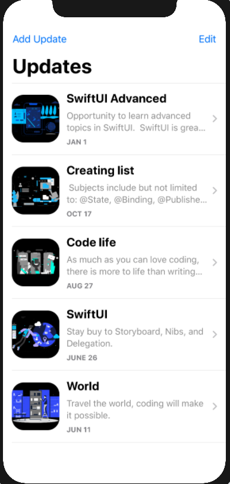
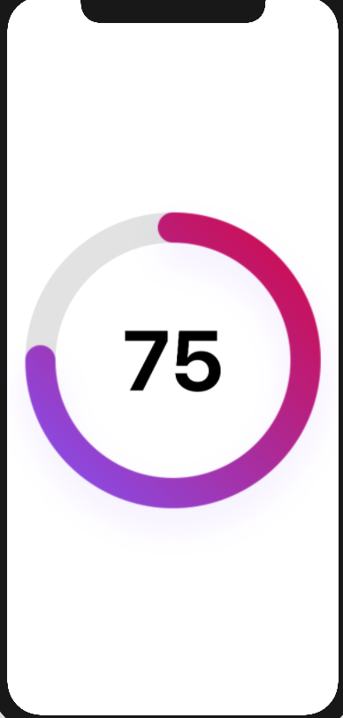
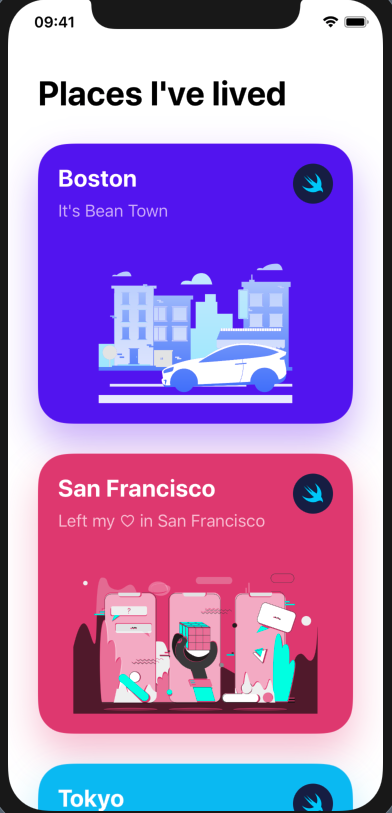
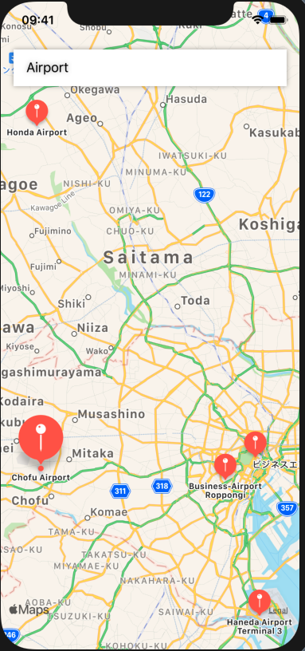

# SwiftUI_Templates
Just a repository to store SwiftUI templates.

Templates created:
- List and Detail
- RingView Component
- List with Interactive Cell
- SwiftUI implementation of MapKit from UIKit

# List and Detail

# Ring view

# Interactive List

# Map Searching Locations

# Map Show routes between two locations
