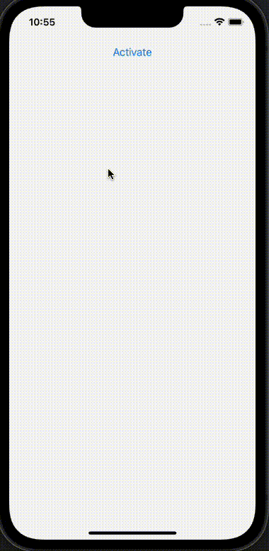
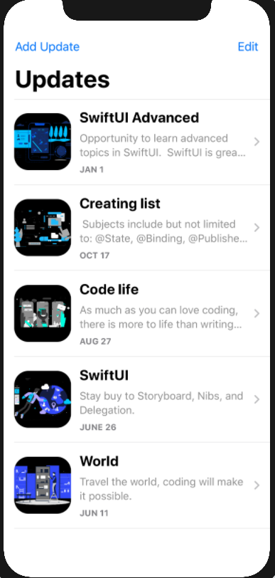
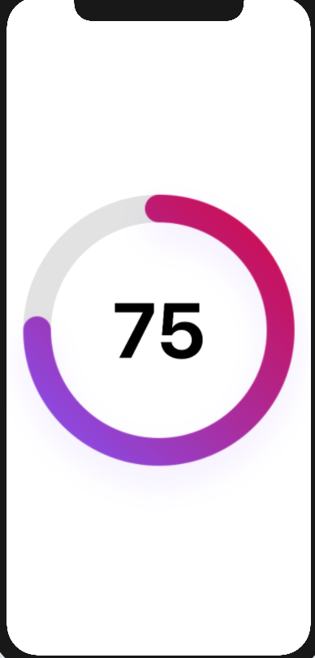
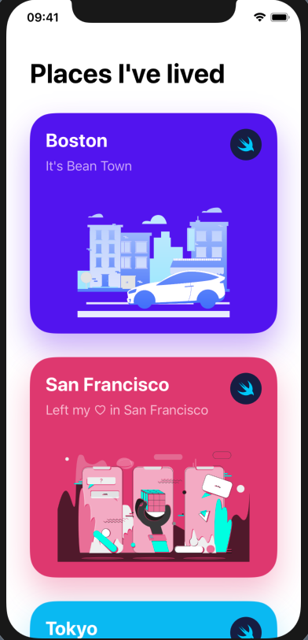
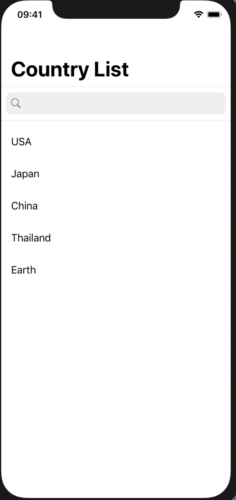
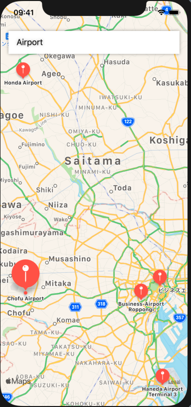
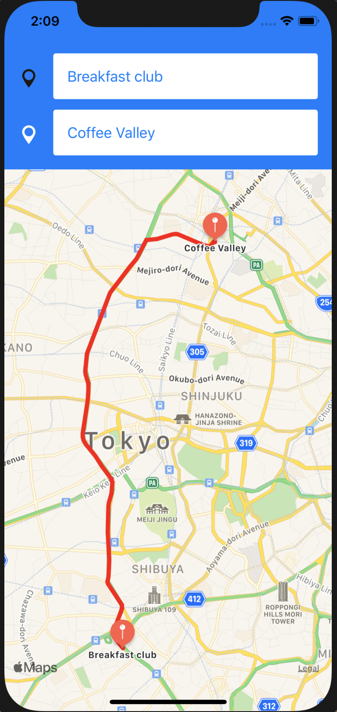

# SwiftUI_Templates
Just a repository to store SwiftUI templates.

# Animated Side Menubar

# List -> Detail

# Ring view

# Interactive list

# Search Bar

# Map: searching locations

# Map: routes between two locations

# Button With Animation

# Button With Transition

# Pay button

