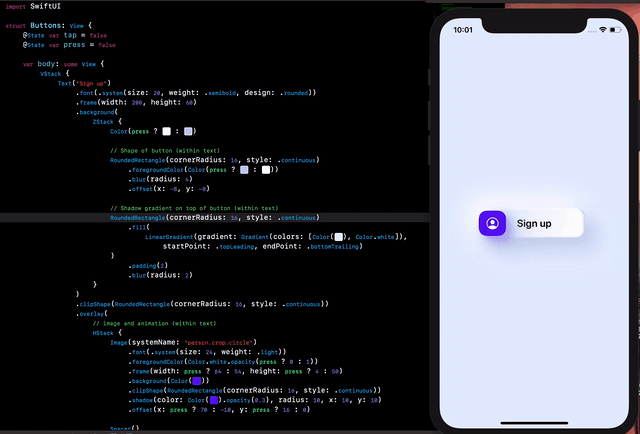

# SwiftUI_Templates
Just a repository to store SwiftUI templates.

Templates created:
- List -> Detail
- Ring view
- List with Interactive Cell
- SwiftUI implementation of MapKit from UIKit

# List -> Detail

# Ring view

# Interactive list

# Map: searching locations

# Map: routes between two locations

# Button Animation

